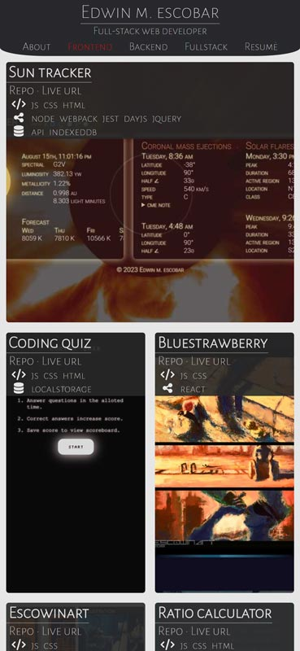
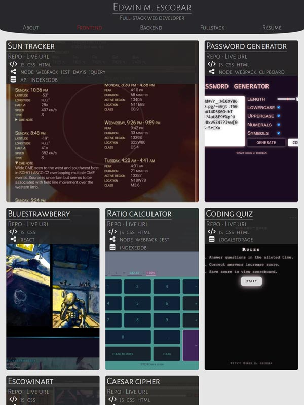
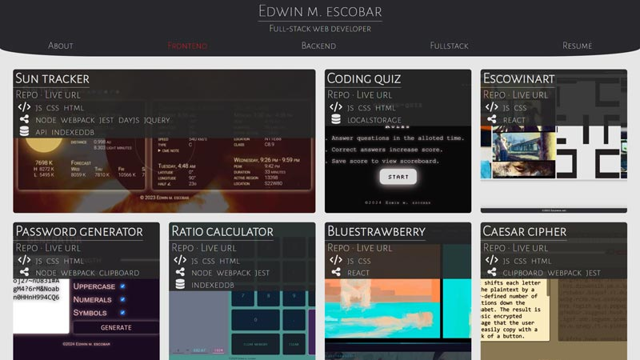

# portfolio

## Description
* [Repo](https://github.com/escowin/portfolio)
* [Live URL](https://escowin.github.io/portfolio)

Built a portfolio with React. Exercising my ability to use state, hooks, and props to create an aesthetically responsive SPA.

## Table of Contents
- [Installation](#installation)
- [Code](#code)
- [Test](#test)
- [Screenshots](#screenshots)
- [Author](#author)

## Installation
Run the following command to install necessary dependencies:
```
$ npm i;
```

## Code
- Languages: CSS, Javascript
- Frameworks: React
- Libraries: fortawesome


## Screenshots







## Author
### Edwin M. Escobar
- [Email](mailto:edwin@escowinart.com)
- [GitHub](https://github.com/escowin)
